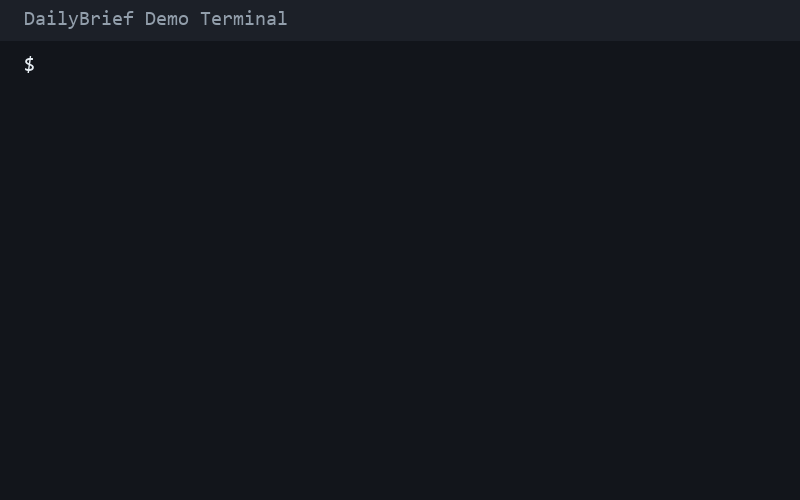

<!-- GitHub Sponsors badge placeholder: add your badge markdown here -->

# dailybrief

[](https://github.com/sponsors/Aloostor)

dailybrief, bir klasordeki Markdown ve metin notlarini toplayip Anthropic API ile kisa bir gunluk brifing ureten bir Python CLI aracidir.
Notlar Turkce ve Ingilizce karisik olsa bile icerigi analiz ederek tek bir duzenli ciktida ozetler.
Terminalde Rich ile baslik, tarih, brifing paneli ve kaynak dosya sayisi ile okunakli bir gorunum sunar.

## Kurulum

1. (Opsiyonel) Sanal ortam olusturun ve aktif edin.
2. Bagimliliklari kurun:

```bash
pip install -r requirements.txt
```

## Ortam Degiskeni

`ANTHROPIC_API_KEY` zorunludur.

PowerShell:

```powershell
$env:ANTHROPIC_API_KEY="your_api_key"
```

cmd.exe:

```bat
set ANTHROPIC_API_KEY=your_api_key
```

bash/zsh:

```bash
export ANTHROPIC_API_KEY="your_api_key"
```

Projede bir ornek dosya bulunur: `.env.example`.
Kendi ortam dosyanizi olusturmak icin kopyalayip degerleri doldurabilirsiniz.

## Kullanim

```bash
python -m dailybrief --source ./notes
```

Not: `--source` verilmezse varsayilan olarak `./notes` kullanilir.

## Demo



Demo GIF'i yeniden uretmek icin: `python scripts/generate_demo.py`

VHS kurulumu: https://github.com/charmbracelet/vhs
Demoyu yeniden olusturmak icin: `vhs demo.tape`

## Katkida Bulunma

Gelistirme onerileri icin issue acabilir veya dogrudan PR gonderebilirsiniz.

## Lisans

Bu proje MIT lisansi ile lisanslanmistir. Ayrintilar icin `LICENSE` dosyasina bakin.
